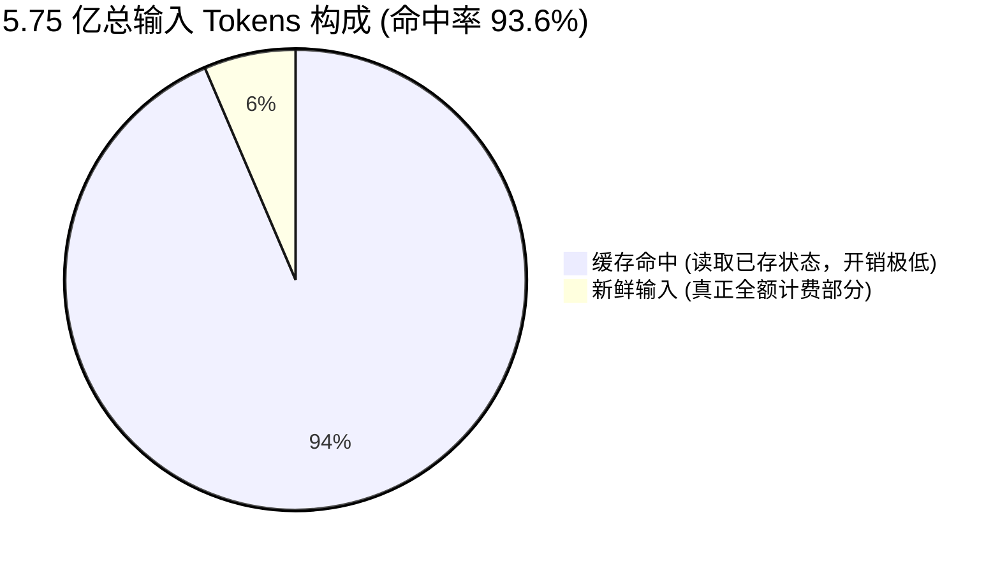

# ob-harness 实践：大模型账单里藏着的 87 倍输入差秘密

**摘要**：AI编程时输入Token常远超输出。本文结合实际日志拆解大模型前缀缓存机制，揭示多轮对话如何依靠“免投资、低读取”的杠杆，将超94%的冗长上下文转化为廉价缓存，完美覆盖近87倍的输入输出落差。

---

AI 辅助编程的账单结构出现了一个反常的数字比例。近期我们在 ob-harness 项目中统计了助手工具的实际日志：在 41 个会话中，总共产生了 5.75 亿个输入 Tokens，但模型实际生成的输出只有 663 万个 Tokens。**输入规模是输出的将近 87 倍。**

## 为什么输入远大于输出

输入规模之所以远超输出，根源在于代码助手特殊的上下文机制。每一次交互，Agent 都要把**完整上下文重新发给模型**，而模型最终的生成仅仅是当前这一轮的增量响应。

在输入端，系统需要打包发送极其庞杂的前提要求：从系统级的架构提示（例如项目规则或技能索引），到**全部工具的严谨定义**（包含庞大的文件操作和架构组件 Schema），再到模型刚才读过的**所有文件全文**，以及越往后叠越长的**整段对话历史**。而在输出端，模型真正下发的结果往往只有一个动作指令加上几句说明，平均下来不到两千 Tokens。

**输入是累积的（第 N 轮输入几乎等于前 N-1 轮内容的总和），而输出是单次增量的。** 这种模型通讯结构，让几十行的代码输出必须建立在几十万字的前置信息之上，天然造就了悬殊的数字比值。

这种重型输入如果严格按照基准单价买单，成本代价极高。削减这部分账面开销的核心机制是**前缀缓存（Prompt Caching）**。模型处理输入信息时，要把文本转化为多层注意力机制的中间结果（**KV Cache**），这是大模型在输入阶段最大的算力消耗。前缀缓存的逻辑，就是把算过的中间结果保留下来。当后续对话传来相同的文本前缀时，模型直接沿用这部分结果，跳过重复计算。

这套机制把输入分成了投资与回报两个阶段。

系统首次遇到一段新前缀，需要从头计算并将其存入系统。这被称为**缓存写入**，也是整个过程的**算力投资**，带有真实的计算负担。系统再次遇到相同前缀时，进入**缓存命中**阶段，直接读取保存好的状态收获**回报**。这类似第一次将源码编译成目标文件，而后续只要源码没变就直接链接，时间与算力开销都降到了最低。

![多轮对话缓存读取与写入演示序列图](https://mermaid.ink/img/eyJjb2RlIjogInNlcXVlbmNlRGlhZ3JhbVxuICAgIHBhcnRpY2lwYW50IFVzZXIgYXMgXHU3NTI4XHU2MjM3L1x1NWJhMlx1NjIzN1x1N2FlZlxuICAgIHBhcnRpY2lwYW50IE1vZGVsIGFzIFx1NmEyMVx1NTc4Ylx1OGJhMVx1N2I5N1x1NWM0MlxuICAgIHBhcnRpY2lwYW50IENhY2hlIGFzIEtWIENhY2hlIFx1NWI1OFx1NTBhOFxuXG4gICAgTm90ZSBvdmVyIFVzZXIsIENhY2hlOiBcdTdiMmNcdTRlMDBcdThmNmVcdWZmMWFcdTYyOTVcdThkNDRcdTk2MzZcdTZiYjVcdWZmMDhcdTdmMTNcdTViNThcdTUxOTlcdTUxNjVcdWZmMDlcbiAgICBVc2VyLT4-TW9kZWw6IFx1NTNkMVx1OTAwMVx1ZmYxYVtcdTdjZmJcdTdlZGZcdTg5YzRcdTgzMDMgKyBcdTk1ZWVcdTk4OTggMV1cbiAgICBNb2RlbC0-Pk1vZGVsOiBcdTUxNjhcdTkxY2ZcdThiYTFcdTdiOTdcdWZmMDhcdTZkODhcdTgwMTdcdTdiOTdcdTUyOWJcdWZmMDlcbiAgICBNb2RlbC0-PkNhY2hlOiBcdTViNThcdTUxNjVcdThiYTFcdTdiOTdcdTdlZDNcdTY3OWNcdWZmMDhcdTYyOTVcdThkNDRcdWZmMDlcbiAgICBNb2RlbC0tPj5Vc2VyOiBcdThmZDRcdTU2ZGVcdThmOTNcdTUxZmEgMVxuXG4gICAgTm90ZSBvdmVyIFVzZXIsIENhY2hlOiBcdTdiMmNcdTRlOGNcdThmNmVcdWZmMWFcdTU2ZGVcdTYyYTVcdTk2MzZcdTZiYjVcdWZmMDhcdTdmMTNcdTViNThcdTU0N2RcdTRlMmRcdWZmMDlcbiAgICBVc2VyLT4-TW9kZWw6IFx1NTNkMVx1OTAwMVx1ZmYxYVtcdTdjZmJcdTdlZGZcdTg5YzRcdTgzMDMgKyBcdTk1ZWVcdTk4OTggMSArIFx1OTVlZVx1OTg5OCAyXVxuICAgIENhY2hlLS0-Pk1vZGVsOiBcdThiZmJcdTUzZDZbXHU3Y2ZiXHU3ZWRmXHU4OWM0XHU4MzAzICsgXHU5NWVlXHU5ODk4IDFdIChcdThkZjNcdThmYzdcdThiYTFcdTdiOTcpXG4gICAgTW9kZWwtPj5Nb2RlbDogXHU1M2VhXHU1YmY5W1x1OTVlZVx1OTg5OCAyXVx1OGZkYlx1ODg0Y1x1NTg5ZVx1OTFjZlx1OGJhMVx1N2I5N1xuICAgIE1vZGVsLT4-Q2FjaGU6IFx1NWI1OFx1NTE2NVx1NjViMFx1NzI0N1x1NmJiNVxuICAgIE1vZGVsLS0-PlVzZXI6IFx1OGZkNFx1NTZkZVx1OGY5M1x1NTFmYSAyIn0?bgColor=ffffff)

大模型目前的定价策略彻底分开了这两种情况。从 GitHub Copilot 针对 Gemini 3.1 Pro (Preview) 的计费表上看，常规输入的单价是 200，输出单价是 1200，而命中缓存输入的单价仅有 20。**命中缓存的开销只有普通输入的十分之一。**

至于缓存写入阶段，**Gemini 计费表直接标价为零。**结合前面的 ob-harness 项目数据，这也解释了系统中缓存写入的录得数据恒为零的现象。服务提供方在这类环境中自行吸收了处理新前缀的算力投资，让用户独享了跳过重复计算省下的全部空间。

## 沉淀即省钱：会话越长，成本越低

在免除写入成本、加上缓存读取只有一折开销的规则下，庞大上下文的多轮对话变成了一个**高杠杆的复用场景**。我们拉取了不同会话交互规模下的缓存表现数据，进一步印证了这个“飞轮效应”：

| 会话规模阶段 | 交互轮次 | 会话总数 | 消耗总输入 Tokens | 缓存命中率 |
| :--- | :--- | :--- | :--- | :--- |
| **冷启动期** | <30 次 | 14 | 1065.1 万 | **74.6%** |
| **温热期** | 30 - 100 次 | 14 | 4834.2 万 | **89.0%** |
| **长线常驻期** | >100 次 | 13 | 5.18 亿 | **94.4%** |

- **30次以内的短会话（冷启动期）**：输入缓存率处于全场最低，仅有 **74.6%**。因为系统还在频繁地确立业务背景与核心代码意图，每一次前置文件和工作区规章的载入都是一次巨大的全新的“算力投资”。
- **100次以上的深水区（长线常驻期）**：输入缓存率飙升至极高的 **94.4%**。在这个阶段，厚重的项目底座、庞杂的技能索引以及漫长的对话上下文，已经固化为一座水面下的巨大冰山。大模型每次只需用极其廉价的开销提取这座“冰山”，仅仅只对水面上最新丢入的几个指令（新鲜输入）计取真正的全额单价。

最终，这个极致的复用机制把重复输入的有效成本极限压缩到了 **6.4%**（实际仅按 3679.9 万 Tokens 的新鲜配额计费）。可以说，看似令人恐惧的 87 倍输入规模差，剥开账单后实质是**近乎免费的缓存极速提款**。同一段繁重前提在这个结构下实现了反复且高效的复用，不仅抹平了账面上的天价差额，更是当前这套极高上下文依赖的工程辅助系统得以不崩溃运转的终极秘密。